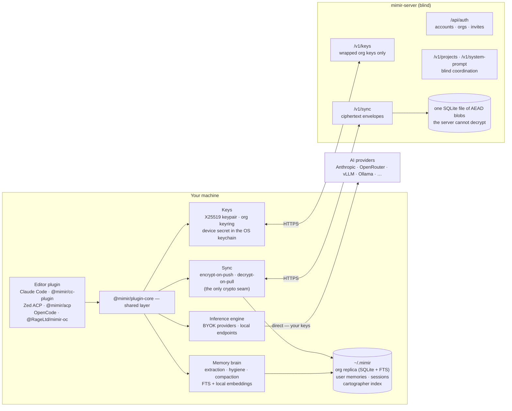

# Mimir

A coding agent with persistent memory and a personality, running inside the editor you already use — Claude Code, Zed (via ACP), or OpenCode. Everything that reads your data runs on your machine: memory extraction, embeddings, retrieval, and inference are all local. The server exists only to sync encrypted memory between your devices and teammates — and it can't read any of it.

> [!IMPORTANT]
> **Security:** Mimir is built so that the server operator can never read your data — memories, code, and conversations stay on your machine or leave it only as ciphertext. Read exactly what the server can and cannot see in [THREAT_MODEL.md](./THREAT_MODEL.md).

## Architecture



The server has exactly four jobs: **auth** (accounts, orgs, invites), **wrapped-key distribution** (it stores org keys encrypted to each member's public key, never the keys themselves), **ciphertext sync** (opaque envelopes with last-write-wins convergence), and **blind coordination** (project registry, system prompt, sync leases). It runs no models, computes no embeddings, and parses no memory content.

## How It Works

### Memory

Every session is distilled into memories **on your machine**, by an extraction model you configure (`MIMIR_EXTRACTION_BASE_URL` / `MIMIR_EXTRACTION_MODEL` — an Ollama instance works fine). The transcript never leaves your machine. Memories land in a local SQLite replica with full-text search and local vector embeddings; retrieval on each turn is a hybrid FTS + cosine search over that replica. Memory hygiene — consolidating near-duplicates, resolving contradictions, forgetting stale facts — also runs locally on the same model.

Two stores, two scopes: **org memory** (project decisions, conventions, session summaries — synced to your org, encrypted) and **user memory** (facts about you — profile, preferences — local only, never synced).

### Sync and Encryption

Encryption lives at exactly one seam: the sync module. The local replica is plaintext (it sits on the same disk as your code); on push, each memory is sealed into an AEAD envelope (AES-256-GCM, with authenticated data binding the envelope to its org and key generation so the server can't transplant ciphertexts); on pull, envelopes are opened locally. Convergence is last-write-wins with tombstoned deletes. Sync runs at session boot, after each turn's distillation, and on demand via `mimir sync`.

Key material follows the 1Password shape: each user holds an X25519 keypair; the org data key is wrapped per member; a device secret — stored in the OS credential store (macOS Keychain / libsecret / Windows Credential Manager) — protects your keyset. Ceremonies run through the CLI:

```bash
mimir keys setup      # first device — prints your device secret EXACTLY ONCE
mimir keys adopt      # bring a new device online with that secret
mimir keys status     # what this device holds
mimir keys rotate     # rotate the org key (revokes removed members)
mimir keys recovery-setup / recover
```

> [!WARNING]
> The device secret is printed **exactly once**. Store it in your password manager immediately — it is the only way onto a new device or out of a lost keychain.

Headless environments without a keychain can set `MIMIR_KEY_PASSPHRASE` to use an encrypted-file fallback.

Self-hosting for yourself? With auth disabled the same sync protocol runs in plaintext mode — no keys, no ceremonies, one fewer moving part. The threat model doc covers what each mode guarantees.

### Inference

No inference ever transits the server.

- **Claude Code** — the plugin runs Mimir as a persona inside Claude Code itself; inference is billed to your Anthropic plan. No API key needed.
- **Zed (ACP) and OpenCode** — a local engine calls providers directly with your own keys. Standard env vars activate providers (`ANTHROPIC_API_KEY`, `OPENROUTER_API_KEY`, `OPENCODE_API_KEY`, and anything else in the [models.dev](https://models.dev) registry); local endpoints register via `VLLM_BASE_URL`, `OLLAMA_BASE_URL`, or `LMSTUDIO_BASE_URL`. Discovered models appear in the editor's model picker.

## Packages

| Package | Description |
|---------|-------------|
| `packages/plugin-core` | Shared layer: memory brain, inference engine, keys, sync, rules, cartographer |
| `packages/cc-plugin` | Claude Code plugin — persona, hooks, MCP wiring, the `mimir` wrapper command |
| `packages/acp` | ACP agent — full local agent for ACP editors (Zed) |
| `packages/oc-plugin` | OpenCode plugin — persona, tools, hooks as a single bundled plugin |
| `packages/server` | The blind sync server — auth, key distribution, ciphertext sync, coordination |

## Install

Pick the editor you use. Each plugin needs a mimir-server URL (hosted or self-hosted — see below) and, for encrypted sync, an API key from that server.

The Claude Code plugin ships as a precompiled binary — no runtime to install. The Zed (ACP) and OpenCode plugins run from source, so they need [Bun](https://bun.sh) v1.3+ on the machine (OpenCode also uses it for the `mimir keys` ceremonies).

### Claude Code

Requires an authenticated `gh` CLI and `~/.local/bin` on your `PATH`. Inside Claude Code:

```
/plugin marketplace add RageLtd/claude-plugins
/plugin install mimir-cc@rageltd
/mimir-install
```

The installer downloads the prebuilt `mimir-cc` binary, writes the runtime under `~/.mimir/`, and lands a `mimir` wrapper that launches Claude Code as Mimir. Full walkthrough, from-source path, and troubleshooting in [`packages/cc-plugin/README.md`](packages/cc-plugin/README.md).

### Zed (ACP)

Register the agent in Zed's `settings.json`. Configuration is entirely through the env block — provider keys for inference, the extraction model for memory:

```json
{
  "agent_servers": {
    "mimir": {
      "type": "custom",
      "command": "bun",
      "args": ["run", "/path/to/mimir/packages/acp/index.ts"],
      "env": {
        "MIMIR_SERVER_URL": "https://your-mimir-server",
        "MIMIR_API_KEY": "...",
        "OPENROUTER_API_KEY": "...",
        "MIMIR_EXTRACTION_BASE_URL": "http://localhost:11434",
        "MIMIR_EXTRACTION_MODEL": "qwen3:8b"
      }
    }
  }
}
```

Any provider key the engine recognizes can replace or join `OPENROUTER_API_KEY`. The full env reference lives in [`packages/acp/README.md`](packages/acp/README.md).

### OpenCode

The plugin ships via GitHub Packages. Add the scope to `~/.bunfig.toml` (needs a token with `read:packages`), install, then run the in-editor installer:

```toml
[install.scopes]
"RageLtd" = { url = "https://npm.pkg.github.com", token = "$GITHUB_TOKEN" }
```

```bash
opencode plugin @RageLtd/mimir-oc
opencode           # then run /mimir-install inside
```

Details in [`packages/oc-plugin/README.md`](packages/oc-plugin/README.md).

### Self-Hosting the Server

The server is a single container with a SQLite file — no database service to run:

```bash
git clone <repo-url> && cd mimir
cp .env.example .env      # defaults work for a local single-user setup
docker compose up -d
curl http://localhost:8080/health
```

The compose file pulls the prebuilt image (`ghcr.io/rageltd/mimir-server:next`); the package is private, so the host needs a one-time GHCR login — token setup in [`packages/server/README.md`](packages/server/README.md#pulling-the-published-image). To build from your working tree instead, drop a `compose.override.yaml` with a `build:` block (also documented there).

The entire config surface:

| Variable | Default | Purpose |
|----------|---------|---------|
| `MIMIR_PORT` / `MIMIR_HOST` | `8080` / `0.0.0.0` | Bind address |
| `MIMIR_DB_PATH` | `./mimir.sqlite` | The tenant store — envelopes, cursors, leases, projects |
| `SYSTEM_PROMPT_PATH` | `./system-prompt.md` | Mimir's persona |
| `AUTH_ENABLED` | `false` | Off = single-user plaintext mode; on = accounts + E2E sync |
| `AUTH_SECRET` / `AUTH_DB_PATH` / `AUTH_BASE_URL` / `AUTH_SETUP_TOKEN` | — | Required only when auth is enabled |

With auth off (the default), the server boots ungated for single-user self-hosting. With auth on, the first boot is claimed via `AUTH_SETUP_TOKEN`, and clients authenticate with API keys.

## Development

Bun v1.3+ required; Docker only if you're running the server.

```bash
bun install

bun run server:dev        # server outside Docker, with --watch
bun run acp:start         # ACP adapter in dev mode
bun run cc-plugin:build   # compile the Claude Code plugin binaries

bun run check             # lint + format (biome)
bun run typecheck

# Tests — always via the root harness, never `bun test <path>`
bun run test              # all packages
bun run test:server       # or one of: server, acp, cc-plugin, oc-plugin, plugin-core
```

## Project Structure

```
mimir/
├── packages/
│   ├── plugin-core/            # Shared layer (@mimir/plugin-core)
│   │   └── src/
│   │       ├── brain/          # Extraction, retrieval, hygiene, summarization
│   │       ├── engine/         # Inference: provider registry, turn streaming
│   │       ├── keys/           # Crypto, keysets, keyrings, device secret, ceremonies
│   │       ├── sync/           # Envelope seal/open, sync engine, CLI
│   │       ├── store/          # SQLite replica + user-memory stores
│   │       ├── cartographer/   # Tree-sitter index client (fully local)
│   │       └── rules/ tools/ project/
│   │
│   ├── cc-plugin/              # Claude Code plugin (@mimir/cc-plugin)
│   ├── acp/                    # ACP agent (@mimir/acp)
│   ├── oc-plugin/              # OpenCode plugin (@RageLtd/mimir-oc)
│   │
│   └── server/                 # Blind sync server (@mimir/server)
│       ├── src/
│       │   ├── auth/           # Better Auth: accounts, orgs, API keys
│       │   ├── db/             # Tenant store (bun:sqlite)
│       │   ├── routes/         # keys, sync, projects, system-prompt, mcp
│       │   └── middleware/     # Identity gate, scoping
│       ├── system-prompt.md    # Mimir's personality and rules
│       └── Dockerfile
│
├── tests/run-tests.ts          # Root test harness (bun run test[:pkg])
├── docker-compose.yml          # The server (pulls the published image)
├── .env.example                # Server environment template
├── THREAT_MODEL.md             # What the server can and cannot see
└── biome.json                  # Shared linting config
```
