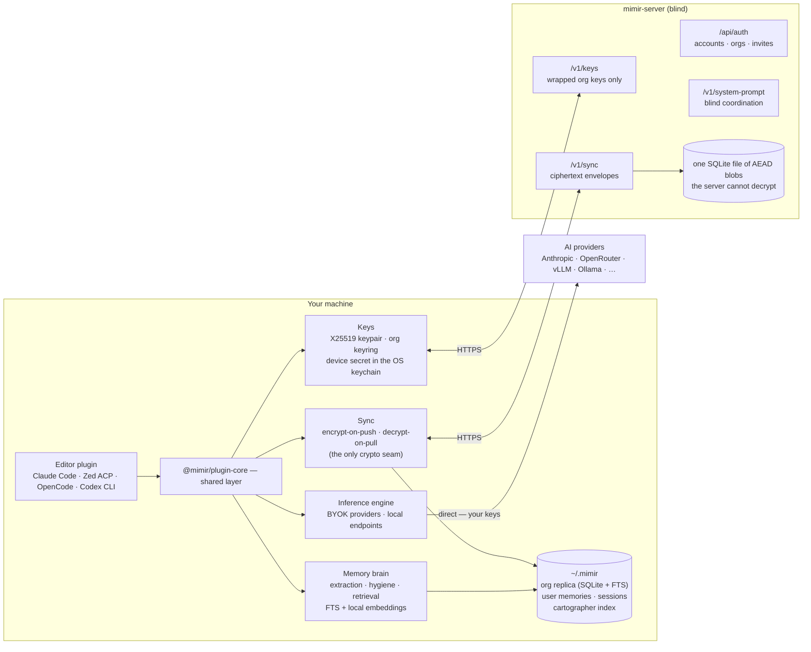

# Mimir

A coding agent with persistent memory and a personality, running inside the editor you already use — Claude Code, Zed (via ACP), OpenCode, or OpenAI Codex CLI.

Mimir is not another chat window. It is a memory brain and a persona that attach to the agent you already have. It remembers the decisions you made three weeks ago, knows how your codebase is wired, enforces your team's rules at the moment you're about to break them, and talks like someone who has opinions about your architecture.

Everything that reads your data runs on your machine: memory extraction, embeddings, retrieval, and inference are all local. The server exists only to sync encrypted memory between your devices and teammates — and it can't read any of it.

> [!IMPORTANT]
> **Security:** Mimir is built so that the server operator can never read your data — memories, code, and conversations stay on your machine or leave it only as ciphertext. Read exactly what the server can and cannot see in [THREAT_MODEL.md](./THREAT_MODEL.md).

## What You Get

| | |
|---|---|
| **Persistent memory** | Every session is distilled into memories on your machine. Two scopes: **project memory** (decisions, conventions, session summaries — synced to your org, encrypted) and **user memory** (your preferences, setup, working style — local only, never synced). |
| **Codebase structure** | Cartographer indexes your repo with tree-sitter. The agent asks "who calls this function" and gets an answer instead of a grep chain. Fully local. |
| **Rules enforcement** | `.enforce.toml` files in your project fire at the moment a tool call would violate them, so the nudge arrives before the mistake, not in review. |
| **A persona that holds** | The Mimir voice is re-anchored on a cadence so it doesn't dissolve into generic-assistant over a long session. |
| **Your models, your keys** | No inference ever transits the Mimir server. Subscription models under Claude Code and Codex; BYOK or local endpoints everywhere else. |

## Architecture



The server has exactly four jobs: **auth** (accounts, orgs, invites), **wrapped-key distribution** (it stores org keys encrypted to each member's public key, never the keys themselves), **ciphertext sync** (opaque envelopes with last-write-wins convergence), and **blind coordination** (system prompt and sync leases). It runs no models, computes no embeddings, and parses no memory content.

Encryption lives at exactly one seam — the sync module. The local replica is plaintext (it sits on the same disk as your code); envelopes are sealed on push and opened on pull. Key material follows the 1Password shape: an X25519 keypair per user, the org data key wrapped per member, and a device secret in the OS credential store. The mechanics are in [`packages/plugin-core/README.md`](packages/plugin-core/README.md#keys-and-sync); the guarantees are in [THREAT_MODEL.md](./THREAT_MODEL.md).

## Install

Pick the editor you use. Each plugin needs a mimir-server URL ([hosted or self-hosted](#self-hosting-the-server)) and, for encrypted sync, an API key from that server.

The Claude Code and Codex CLI plugins ship as precompiled binaries — no runtime to install. The Zed (ACP) and OpenCode plugins run from source, so they need [Bun](https://bun.sh) v1.3+ on the machine.

### Claude Code

Requires an authenticated `gh` CLI and `~/.local/bin` on your `PATH`. Inside Claude Code:

```
/plugin marketplace add RageLtd/claude-plugins
/plugin install mimir-cc@rageltd
/mimir-install
```

The installer downloads the prebuilt `mimir-cc` binary, writes the runtime under `~/.mimir/`, and lands a `mimir` wrapper that launches Claude Code as Mimir. Exit Claude Code, then run `mimir` from any terminal.

→ Walkthrough, from-source path, hook and MCP reference, troubleshooting: [`packages/cc-plugin/README.md`](packages/cc-plugin/README.md)

### OpenAI Codex CLI

Requires an authenticated `gh` CLI and `~/.local/bin` on your `PATH`:

```bash
codex plugin marketplace add RageLtd/mimir
codex plugin add mimir@mimir
codex            # then ask it to "install mimir"
```

Everything lands in a dedicated `CODEX_HOME` (`~/.mimir/codex`) — your own `~/.codex` setup is never touched, and login is shared. Launch Mimir sessions with `mimir-codex`; the wrapper self-updates on each launch.

→ Hook legs, hook-trust ledger, fallback install, dev loop: [`packages/codex-plugin/README.md`](packages/codex-plugin/README.md)

### Zed (ACP)

Register the agent in Zed's `settings.json`. Configuration is entirely through the env block — provider keys for inference, the extraction model for memory:

```json
{
  "agent_servers": {
    "mimir": {
      "type": "custom",
      "command": "bun",
      "args": ["run", "/path/to/mimir/packages/acp/index.ts"],
      "env": {
        "MIMIR_SERVER_URL": "https://your-mimir-server",
        "MIMIR_API_KEY": "...",
        "OPENROUTER_API_KEY": "...",
        "MIMIR_EXTRACTION_BASE_URL": "http://localhost:11434",
        "MIMIR_EXTRACTION_MODEL": "qwen3:8b"
      }
    }
  }
}
```

Any provider key the engine recognizes can replace or join `OPENROUTER_API_KEY`.

→ Full env reference, agent-loop architecture, source layout: [`packages/acp/README.md`](packages/acp/README.md)

### OpenCode

The plugin ships via GitHub Packages, which needs a classic personal access token with `read:packages` in your `~/.npmrc`:

```ini
@RageLtd:registry=https://npm.pkg.github.com
//npm.pkg.github.com/:_authToken=${GITHUB_PACKAGES_TOKEN}
```

```bash
export GITHUB_PACKAGES_TOKEN=ghp_...
opencode plugin --global @RageLtd/mimir-oc
opencode           # then ask it to call mimir_install
```

Restart OpenCode after `mimir_install` succeeds, then launch sessions with `mimir-opencode`.

→ Token requirements, config-file gotchas, upgrade notes from `1.1.0`, release process: [`packages/oc-plugin/README.md`](packages/oc-plugin/README.md)

## Using Mimir

Once installed, most of Mimir is invisible — memory retrieval, persona anchoring, rule checks, and reindexing all happen on hooks around your normal turns. What follows is the surface you actually touch.

### Memory

Mimir stores and recalls on its own, but you can drive it directly by just saying so: *"remember that we settled on last-write-wins for sync"* stores a project memory; *"what did we decide about the auth cutover?"* searches them. Behind that are MCP tools the agent calls — `project_memory_*` and `project_playbook_*` over the synced org replica, `user_memory_*` and `user_profile_*` over your local, never-synced personal store.

The distinction matters: project memory is *facts about this codebase* and travels to your teammates encrypted. User memory is *facts about you* and never leaves the machine.

Memories are distilled by an extraction model you configure (`MIMIR_EXTRACTION_BASE_URL` / `MIMIR_EXTRACTION_MODEL` — a local Ollama works fine). The transcript never leaves your machine.

### Rules

Drop a `.enforce.toml` file anywhere under `.claude/` in your project and Mimir checks it on every matching tool call:

```toml
id = "no-console-log"
event = "file"
message = "Don't ship console.log statements: ${match}"

[[conditions]]
field = "new_text"
operator = "regex_match"
pattern = "console\\.log\\("
```

The violation surfaces to the model alongside the tool call, so it self-corrects before the edit lands. Full format — capture-group interpolation, negative conditions, glob excludes, built-in detectors — in [`packages/cc-plugin/README.md`](packages/cc-plugin/README.md#rules-engine).

### Commands

Slash commands inside the editor:

| Command | Editors | What it does |
|---------|---------|--------------|
| `/mimir-install` | Claude Code, OpenCode | Write the runtime state — system prompt, config, MCP wiring, hooks |
| `/mimir-update` | Claude Code, OpenCode | Re-fetch the system prompt and re-land the runtime |
| `/switch-model` | Claude Code | Restart the session on a different model, bridging continuity through project memory |
| `/run-hygiene` | Claude Code | Sweep the local replica — consolidate near-duplicates, demote contradictions, prune stale facts. Dry-run by default; `--live` applies |

Terminal commands, from the wrapper for your editor (`mimir` for Claude Code, `mimir-opencode`, `mimir-codex`, or `bun run packages/acp/index.ts` for ACP):

```bash
mimir sync                    # pull, apply, push — plus embedding backfill
mimir keys status             # what this device holds
mimir keys setup              # first device — prints your device secret EXACTLY ONCE
mimir keys adopt              # bring a new device online with that secret
mimir keys rotate             # rotate the org key (revokes removed members)
mimir keys recovery-setup / recover
```

> [!WARNING]
> The device secret is printed **exactly once**. Store it in your password manager immediately — it is the only way onto a new device or out of a lost keychain.

Sync also runs automatically at session boot and after each turn's distillation; the manual command is for when you want it now, or want the embedding backfill. Headless environments without a keychain set `MIMIR_KEY_PASSPHRASE` to use an encrypted-file fallback.

Self-hosting for yourself alone? With auth disabled the same sync protocol runs in plaintext mode — no keys, no ceremonies, one fewer moving part.

### Inference

No inference ever transits the server.

- **Claude Code** and **OpenAI Codex CLI** — the host owns the models. Inference bills to your existing Anthropic or OpenAI plan; Mimir contributes the persona and the brain. No API key needed.
- **Zed (ACP)** and **OpenCode** — a local engine calls providers directly with your own keys. Standard env vars activate providers (`ANTHROPIC_API_KEY`, `OPENROUTER_API_KEY`, and anything else in the [models.dev](https://models.dev) registry); local endpoints register via `VLLM_BASE_URL`, `OLLAMA_BASE_URL`, or `LMSTUDIO_BASE_URL`. Discovered models appear in the editor's model picker.

## Self-Hosting the Server

The server is a single container with a SQLite file — no database service to run:

```bash
git clone <repo-url> && cd mimir
cp .env.example .env      # defaults work for a local single-user setup
docker compose up -d
curl http://localhost:8080/health
```

The compose file pulls the prebuilt image (`ghcr.io/rageltd/mimir-server:next`). The package is private, so the host needs a one-time GHCR login — [token setup here](packages/server/README.md#pulling-the-published-image). To build from your working tree instead, drop a `compose.override.yaml` with a `build:` block ([documented here](packages/server/README.md#building-from-source)).

The one decision that shapes everything else is `AUTH_ENABLED`:

- **Off (the default)** — the server boots ungated for single-user self-hosting. Sync runs in plaintext, there are no accounts, and there is no key ceremony. The right shape when the operator and the only user are the same person.
- **On** — accounts, organizations, and end-to-end encrypted sync. Set `AUTH_SECRET` and `AUTH_SETUP_TOKEN`, claim the first account with the setup token, and issue API keys through `/api/auth`. The first claimant gets both organization-owner and instance-operator grants; later grants and runtime settings are managed under `/operator`.

Everything else — bind address, database paths, operator tokens, system-prompt seeding — has a working default. The complete variable table, the container-image tags, and the operator surface are in [`packages/server/README.md`](packages/server/README.md).

## Packages

| Package | Description |
|---------|-------------|
| [`plugin-core`](packages/plugin-core/README.md) | Shared layer: memory brain, inference engine, keys, sync, rules, cartographer |
| [`cc-plugin`](packages/cc-plugin/README.md) | Claude Code plugin — persona, hooks, MCP wiring, the `mimir` wrapper |
| [`acp`](packages/acp/README.md) | ACP agent — full local agent for ACP editors (Zed) |
| [`oc-plugin`](packages/oc-plugin/README.md) | OpenCode plugin — persona, tools, hooks, the `mimir-opencode` wrapper |
| [`codex-plugin`](packages/codex-plugin/README.md) | OpenAI Codex CLI plugin — persona, lifecycle hooks in a dedicated `CODEX_HOME`, the `mimir-codex` wrapper |
| [`server`](packages/server/README.md) | The blind sync server — auth, key distribution, ciphertext sync, coordination |

Editor-agnostic logic ships once in plugin-core with thin per-distribution wiring. A user-facing flow never belongs to one editor.

## Development

Bun v1.3+ required; Docker only if you're running the server.

```bash
bun install

bun run server:dev        # server outside Docker, with --watch
bun run acp:start         # ACP adapter in dev mode
bun run cc-plugin:build   # compile the Claude Code plugin binaries

bun run check             # lint + format (biome)
bun run typecheck

# Tests — always via the root harness, never `bun test <path>`
bun run test              # all packages
bun run test:server       # or one of: server, acp, cc-plugin, oc-plugin, codex-plugin, plugin-core
```

Conventions, code style, and the repository layout live in [CLAUDE.md](./CLAUDE.md). Each package README covers its own build, release, and dev loop.
