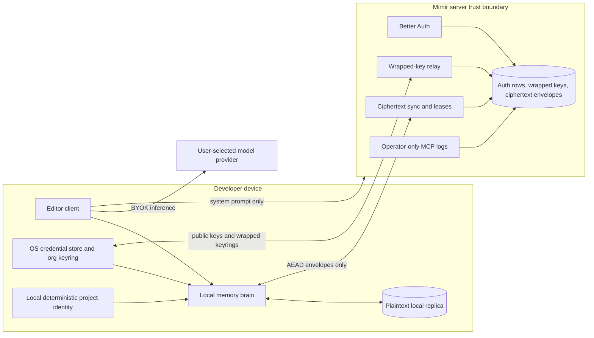

# Mimir Threat Model and Ciphertext Specification

**Document version:** 2
**Envelope write version:** 2
**Scope:** cloud server, editor clients, browser dashboard, local replicas, key distribution, and ciphertext sync
**Status:** repository-grounded security contract

## Executive summary

Mimir's cloud design keeps tenant content and project metadata outside the
operator's trust boundary. Conversations, source code, Cartographer indexes,
embeddings, inference, and project discovery remain local. Memories and
playbooks leave a device only as AES-256-GCM envelopes encrypted with an org
key that the server never receives unwrapped.

Envelope v2 authenticates the record id, org, kind, key generation, record
version, and tombstone bit. A server cannot turn a live record into a delete,
rewrite its version, or transplant its ciphertext without client-side
authentication failure. Accepted server updates are strictly monotonic by
version; equal versions cannot replace authenticated history.

Cryptography cannot prove availability. A malicious server can withhold
records, and a completely fresh or recovered device cannot distinguish the
newest valid snapshot from an older valid snapshot unless it has an
independent checkpoint. An established device rejects lower versions because
its local replica is that checkpoint. Recovery restores decryption keys, not
lost synchronization history.

The remaining deployment caveat is explicit: old server databases may still
contain plaintext rows in the retired `project` table. Current clients derive
project identity locally and the server no longer mounts `/v1/projects`, but
the operator-blind claim is not fully true for an upgraded deployment until
those legacy rows are purged.

## Scope and assumptions

This model assumes the hosted service is reachable from the public internet,
organizations are mutually untrusted tenants, TLS terminates at infrastructure
controlled by the operator, and authenticated org members are allowed to read
their org's shared memory. Auth-disabled plaintext sync is restricted to a
private, single-operator self-hosted deployment.

The operator and a server attacker are treated as able to read and modify the
server database, process memory, logs, responses, and stored ciphertext. They
do not control an uncompromised client, its OS credential store, or the
independent model provider chosen by the user. A malicious client release is a
separate supply-chain threat; release verification is not yet strong enough
to remove it from the critical-risk list.

The model covers confidentiality, tenant isolation, integrity of accepted
encrypted record state, key distribution, and the operator diagnostics
boundary. It does not promise service availability, traffic-analysis
resistance, protection from a compromised developer device, or secrecy from a
current org member who legitimately holds the org key.

## System model



The principal data flows are:

1. The client derives project identity from a normalized git remote, falling
   back to an absolute local path when no remote exists. Project metadata is
   never sent to the server.
2. Local extraction writes plaintext memories to the local SQLite replica.
3. Sync seals dirty rows with the current org key and sends only wire
   envelopes. Pull decrypts and validates them before applying them locally.
4. Key ceremonies generate user X25519 material locally. The server stores
   public keys, encrypted user keysets, and org keyrings wrapped per member.
5. Inference and embeddings run locally or go directly to a provider under
   user-supplied credentials.
6. `/mcp` exposes process logs only after a separate operator bearer token.
   Better Auth tenant sessions and API keys never authorize it.

## Assets and data classification

| Asset | Required property | Server visibility |
|---|---|---|
| Memories and playbooks | Confidentiality and authenticated state | Ciphertext, size, kind, version, timing |
| Conversation transcripts | Confidentiality | Never sent |
| Source code and Cartographer indexes | Confidentiality | Never sent |
| Embeddings | Confidentiality | Never sent |
| Project remote, path, description, and stack | Confidentiality | Never sent by current clients; legacy rows require purge |
| Org data keys and user private keys | Confidentiality | Wrapped or encrypted only |
| Account and org membership | Tenant isolation | Plaintext operational metadata |
| Record versions and sync cursors | Integrity and convergence | Plaintext coordination metadata |
| Operator logs | Operator-only authorization | Process-wide plaintext diagnostics |
| Client release artifacts | Authenticity | Published through the release channel |

The local replica is plaintext by design. It sits on the same device as the
source code and keeps cryptography at one auditable boundary: the sync seam.
Brain, retrieval, FTS, embedding, and hygiene code do not operate on
ciphertext.

## Attacker capabilities

An in-scope server attacker can enumerate tenants and record metadata, replay
or omit stored envelopes, alter any unauthenticated database field, deny
requests, inspect logs, and attempt cross-tenant API access. A malicious org
member can decrypt org content while a member and can race legitimate writes.
An internet attacker can exercise public routes and resource limits.

The attacker cannot derive an org key from the wrapped-key rows without a
member private key, cannot forge an envelope-v2 field without invalidating its
AEAD tag, and cannot authorize the operator MCP with a tenant credential.

## Entry points and trust boundaries

| Entry point | Boundary | Primary controls |
|---|---|---|
| `/api/auth/*` | Internet to identity store | Better Auth, claim/invitation policy, session/API-key validation |
| `/v1/keys/*` | Member to wrapped-key relay | Resolved user/org identity, client-side wrapping, rotation CAS |
| `/v1/sync/push` | Member to ciphertext store | Org scope, strict envelope validation, monotonic versions, downgrade prevention |
| `/v1/sync/pull` | Ciphertext store to client | Org scope, client AEAD verification, local version checkpoint |
| `/v1/sync/lease` | Member to blind coordination | Org scope, bounded TTL |
| `/v1/system-prompt` | Server to client boot | Authentication in cloud mode; content is operator-published |
| `/mcp` | Operator to global diagnostics | Dedicated `MIMIR_OPERATOR_TOKEN`; disabled when unset |
| Dashboard forms and Custom Elements | Browser to same-origin APIs | Session gate, origin checks, local WebAuthn PRF ceremony, text-only rendering |
| Client release/update channel | Publisher to developer device | Private repository transport today; publisher verification remains incomplete |

## Key hierarchy and recovery

```text
device secret (OS credential store, copied once to a password manager)
  └─ HKDF-SHA-256 → decrypts the server-stored encrypted user keyset
       └─ user X25519 private key
            └─ unwraps the per-member org keyring
                 └─ current org key seals envelope payloads

recovery private key (held outside the server)
  └─ unwraps organization.wrappedRecoveryKey
       └─ restores the same org keyring
```

All private-key and wrapping operations happen client-side. Wraps contain all
live key generations so rotated and current envelopes can coexist during
rollover. Removing a member requires rotation; the removed member can retain
content and old generations already received, but cannot decrypt subsequent
generations.

Recovery remains functional under envelope v2. It restores the keyring needed
to decrypt records. It does not restore a wiped device's remembered
high-water versions, so rollback detection after total local-state loss still
needs an independent checkpoint.

The fallback for a host without an OS secret service is a
passphrase-encrypted device-secret file using scrypt and AES-256-GCM. Human-held
secrets are minted only by explicit ceremonies and printed once; background
reconciliation never creates a secret that cannot be shown safely.

## Ciphertext envelope v2

| Field | Type | Authenticated in cloud mode | Notes |
|---|---|---|---|
| `id` | bounded string | yes | Client-generated stable record id |
| `org_id` | string | yes | Supplied as client decryption context, not inside wire JSON |
| `kind` | uint8 | yes | `0x01` memory, `0x02` playbook |
| `envelope_v` | uint8 | yes | Current writes use `2` |
| `suite` | uint8 | yes | `0x01` AES-256-GCM; `0x00` trusted plaintext self-hosting |
| `key_gen` | uint32 | yes | Org key generation |
| `version` | positive safe integer encoded uint64BE in AAD | yes | Must increase strictly for an accepted replacement |
| `tombstone` | bool | yes | Encrypted tombstones seal an empty plaintext |
| `updated_at` | server timestamp | no | Operational only; never decides authenticated state |
| `nonce` | 12 random bytes | carried with ciphertext | Fresh for every AES-GCM seal |
| `payload` | ciphertext and 16-byte tag | AEAD output | Never parsed or logged by the server |

The canonical AAD encoding is:

```text
uint8(envelope_v) || uint8(suite) || uint8(kind) ||
uint32BE(key_gen) || uint64BE(version) || uint8(tombstone) ||
utf8(id) || 0x00 || utf8(org_id)
```

This binds every field that changes record meaning or convergence. Encrypted
tombstones have a fresh nonce and an AEAD tag over zero plaintext bytes.
Changing the tombstone bit, version, id, org, kind, suite, or generation makes
decryption fail.

AES-256-GCM uses Bun's native `node:crypto` implementation. Nonces are random
96-bit values generated inside the seam. A key generation is rotated long
before expected per-org write volume approaches a meaningful random-nonce
collision probability.

Only a version strictly greater than the stored version replaces a record.
Equal versions are rejected. A losing dirty client increments its local
version before retrying, preserving convergence without allowing an equal
version to rewrite authenticated history. Clients also refuse an equal-version
remote record from replacing local clean state.

New clients reject envelope v1 because v1 did not authenticate `version` or
`tombstone`. On first upgraded sync, an established replica marks all retained
rows dirty once and reseals them as v2. The server accepts v1 only as a
temporary old-client transport and will not allow v1 to replace a stored v2
record. Deployment must upgrade at least one established client per org before
depending on a fresh-device recovery from the server copy.

## Top abuse paths

1. **Server forges a delete.** It flips `tombstone` on a live envelope. The
   v2 AEAD check fails; the client records an open failure and does not apply
   the deletion.
2. **Server rewrites a version.** It raises an old ciphertext's outer version
   to defeat local LWW. Version is in AAD, so authentication fails.
3. **Server replays an older valid envelope.** An established device rejects
   the lower version. A fresh device without a checkpoint cannot prove a newer
   envelope existed; this is a residual, not a cryptographic claim.
4. **Tenant reads global logs.** A tenant credential reaches `/mcp`. The
   dedicated operator gate rejects it before Better Auth tenant resolution.
5. **Operator inventories repositories.** Current clients never call a
   project route; identity is locally derived. An upgraded database remains
   exposed until its legacy project rows are purged.
6. **Old client downgrades an authenticated record.** The server refuses any
   lower envelope format once v2 exists for that id; v2 clients reject v1.
7. **Malicious client update steals plaintext and keys.** A compromised
   published binary runs inside the trusted client boundary. Artifact
   attestation and updater verification remain required mitigations.

## Threat register

| ID | Threat | Impact | Existing mitigation | Residual / required action |
|---|---|---|---|---|
| TM-001 | Operator or server compromise reads synced content | Critical | Per-org AES-GCM; keys never unwrapped server-side | Size, timing, kind, and membership metadata remain visible |
| TM-002 | Cross-tenant API or database access | Critical | Better Auth identity gate, org-scoped rows, independent org keys | Compromised member credentials expose that member's org |
| TM-003 | Server forges deletion or rewrites record meaning | High | Envelope-v2 AAD binds version and tombstone; encrypted tombstones | Auth-disabled plaintext mode trusts its private server |
| TM-004 | Server replays or withholds valid state | High | Local high-water versions; strict monotonic acceptance; equal-state refusal | Fresh/wiped devices require an external transparency or peer checkpoint for proof of newest state |
| TM-005 | Tenant reads process-wide logs | High | Dedicated operator token; endpoint disabled when unset | Token rotation and operator secret management remain operational duties |
| TM-006 | Server reads project metadata | High | Deterministic local project identity; `/v1/projects` unmounted | Purge legacy `project` rows before claiming an upgraded deployment is fully operator-blind |
| TM-007 | Malicious or substituted client release | Critical | Open-source review, authenticated private repository transport | Add attestations/digests and verify before binary replacement |
| TM-008 | Compromised developer device reads local data | High | OS device protections and credential store | Plaintext replica and source code are intentionally available to the local user |
| TM-009 | Oversized authenticated input exhausts server resources | Medium | Batch, field, integer, closed-set, nonce, and payload bounds | Add route-wide body limits, quotas, and bounded connection timeouts |
| TM-010 | Removed member reads future content | High | Rotation and per-member wraps | Removed member retains already received plaintext and old key generations |
| TM-011 | Traffic analysis reveals activity | Medium | TLS | Counts, sizes, timing, IPs, and rotations are accepted metadata exposure |
| TM-012 | Public deployment accidentally uses plaintext suite | Critical | Authenticated clients require a keyring; browser rejects plaintext | Keep auth-disabled mode private and single-operator |

## Criticality calibration

Critical threats expose plaintext tenant content or key material across the
service boundary. High threats violate tenant authorization, authenticated
record state, or future confidentiality after revocation. Medium threats leak
operational metadata or create bounded denial-of-service risk. Low threats are
hardening gaps without a direct path to tenant content under the stated
assumptions.

The highest-priority unfinished control is client release authenticity
(TM-007). The operator-blind project change is code-complete for new traffic,
but an existing deployment does not close TM-006 until its old rows are
purged. Availability and fresh-device rollback proof require a separate
transparency design rather than more fields in the same server-controlled
database.

## Focus paths for future reviews

Security reviews should begin at these ownership seams:

- `packages/plugin-core/src/sync/envelope.ts` and `sync/engine.ts` for
  authenticated wire state and migration behavior.
- `packages/plugin-core/src/keys/` for device secrets, recovery, wrapping,
  rotation, and key zeroization.
- `packages/server/src/routes/sync.ts` and `db/tenant.ts` for validation,
  strict versions, org isolation, cursors, and garbage collection.
- `packages/server/src/middleware/operator.ts` and `routes/mcp.ts` for the
  operator/tenant diagnostics boundary.
- `packages/plugin-core/src/project/` for local project identity and legacy-id
  migration.
- `packages/server/src/web/browser/memory-*` for browser validation,
  zeroization, and byte compatibility with the canonical seam.
- `.github/workflows/*release*` and updater scripts for the unresolved client
  authenticity boundary.

## Self-hosted mode

Auth-disabled self-hosting uses suite `0x00` and trusts the private server. It
provides protocol compatibility and debuggability, not operator-blind
confidentiality or authenticated deletion. It must not be exposed as a
multi-tenant public service. Brain behavior stays identical; only the sync
seam changes cipher mode.
