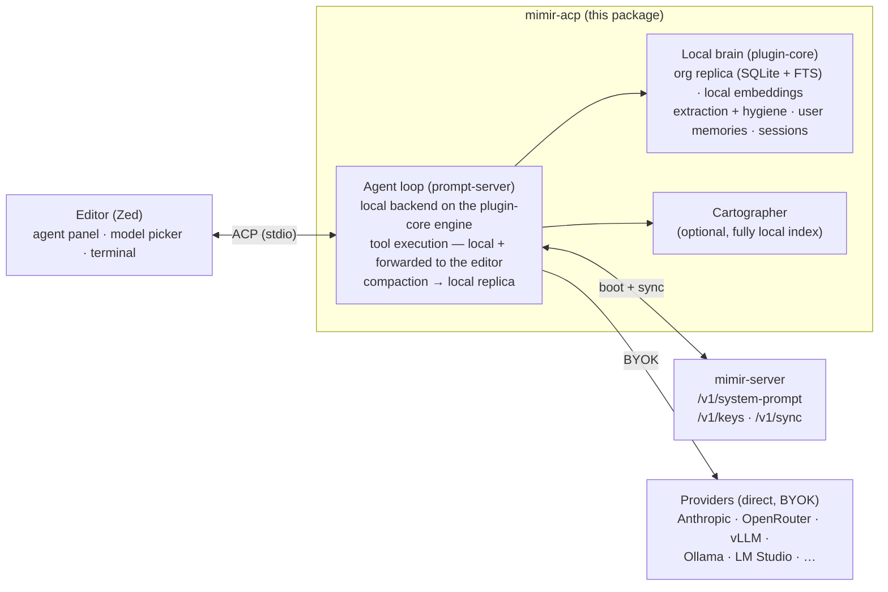

# @mimir/acp

ACP (Agent Client Protocol) agent for Mimir — connects editor agent panels (primarily Zed) to a **fully local** agent. Inference, the agent loop, tool execution, memory retrieval, extraction, compaction, and project identity all run in this process on plugin-core; the server is contacted only for the boot-time system prompt, key distribution, and encrypted memory sync.

## Architecture



Every model in the editor's picker resolves through the local provider registry — providers activate from your own env keys (BYOK) or local base URLs. No inference traffic ever transits mimir-server.

## Configuration

All configuration is via environment variables, set in the editor's agent env block. See `src/config.ts` for defaults.

**Server connection:**

| Variable | Default | Description |
|---|---|---|
| `MIMIR_SERVER_URL` | `http://mimir.conhost.lan` | mimir-server base URL |
| `MIMIR_API_KEY` | (empty) | Server API key — required for encrypted sync against an auth-enabled server |

**Inference (BYOK — keys never leave your machine):**

| Variable | Description |
|---|---|
| `ANTHROPIC_API_KEY`, `OPENROUTER_API_KEY`, `OPENCODE_API_KEY`, … | Any provider key in the [models.dev](https://models.dev) registry activates that provider's models |
| `VLLM_BASE_URL` / `OLLAMA_BASE_URL` / `LMSTUDIO_BASE_URL` | Local OpenAI-compatible endpoints — models auto-discovered |
| `MIMIR_MODEL` | Default model (empty = editor picker drives it) |
| `MIMIR_SMALL_MODEL` | Cheap model for background jobs (extraction, compaction) |

**Memory brain:**

| Variable | Default | Description |
|---|---|---|
| `MIMIR_EXTRACTION_BASE_URL` | — | OpenAI-compatible endpoint for local memory distillation |
| `MIMIR_EXTRACTION_MODEL` | falls back to `MIMIR_SMALL_MODEL` | Extraction/summarization model |
| `MIMIR_EXTRACTION_API_KEY` | falls back to `MIMIR_PROVIDER_API_KEY` | Optional — keyless local endpoints work |
| `MIMIR_ORG_REPLICA_DB` | `~/.mimir/org-replica.db` | Local org-memory replica (SQLite) |
| `MIMIR_USER_MEMORY_DB` | `~/.mimir/user-memories.db` | Local user-memory store |
| `MIMIR_SESSION_DB` | `~/.mimir/sessions.db` | Session persistence |

**Everything else:**

| Variable | Default | Description |
|---|---|---|
| `MIMIR_CARTOGRAPHER_ENABLED` | `true` | Cartographer codebase indexing (fully local) |
| `MIMIR_CARTOGRAPHER_BIN` | `cartographer` | Binary path, resolved on `PATH` |
| `AUTO_APPROVE_TOOLS` | `false` | Auto-approve read/search tool calls |
| `MIMIR_ACP_LOG_FILE` | `~/.mimir/logs/acp.log` | Log file (empty string disables) |
| `LOG_LEVEL` | `info` | `debug` / `info` / `warn` / `error` |

## Key ceremonies and sync

The E2E key ceremonies and manual sync run as argv subcommands, dispatched before the ACP handshake:

```bash
bun run packages/acp/index.ts keys <status|setup|adopt|rotate|recovery-setup|recover>
bun run packages/acp/index.ts sync
```

The implementation is shared plugin-core code — the same ceremonies as `mimir keys` under Claude Code and OpenCode. Sync also runs automatically at engine boot and after each turn's distillation.

## Source layout

```
index.ts                    # Entry point — argv dispatch (keys/sync), then ACP handshake
src/
├── agent/                  # Agent factory, session management, the local agent loop
│   ├── index.ts            # createMimirAgent — replica + engine boot, agent factory
│   ├── core.ts             # Prompt routing, mode/model switching
│   ├── prompt-server.ts    # The agent loop: context assembly, tool cycle, events
│   ├── brain.ts            # Extraction + compaction wiring into the replica
│   ├── turn-context.ts     # Per-turn context injection, TodoWrite plan tool
│   ├── model-resolution.ts # Local registry → editor model picker
│   ├── session.ts          # Session state
│   ├── commands.ts         # Slash commands
│   ├── tool-dispatch.ts / tool-reporting.ts / client-tools.ts
│   └── content.ts / handlers.ts / lifecycle-helpers.ts / types.ts
├── backends/               # Backend abstraction — local.ts (plugin-core engine)
├── engine-boot.ts          # Provider registry init + system-prompt fetch (cached)
├── client-mcp/             # User-configured MCP servers exposed to the loop
├── mcp-config/             # MCP configuration assembly
├── cartographer/           # Local tree-sitter index integration
├── store/                  # Session persistence (bun:sqlite)
├── tools/                  # User-memory stdio MCP
├── permissions.ts          # Tool permission gating
└── config.ts               # Env-based configuration
```

## Running

```bash
# Development (stdio — connect via Zed's agent_servers config)
bun run start

# Compile to standalone binary
bun run build
```

The agent speaks NDJSON over stdin/stdout per the ACP specification. The Zed registration snippet lives in the [root README](../../README.md#zed-acp).

## Testing

Always via the root harness:

```bash
bun run test:acp
```
